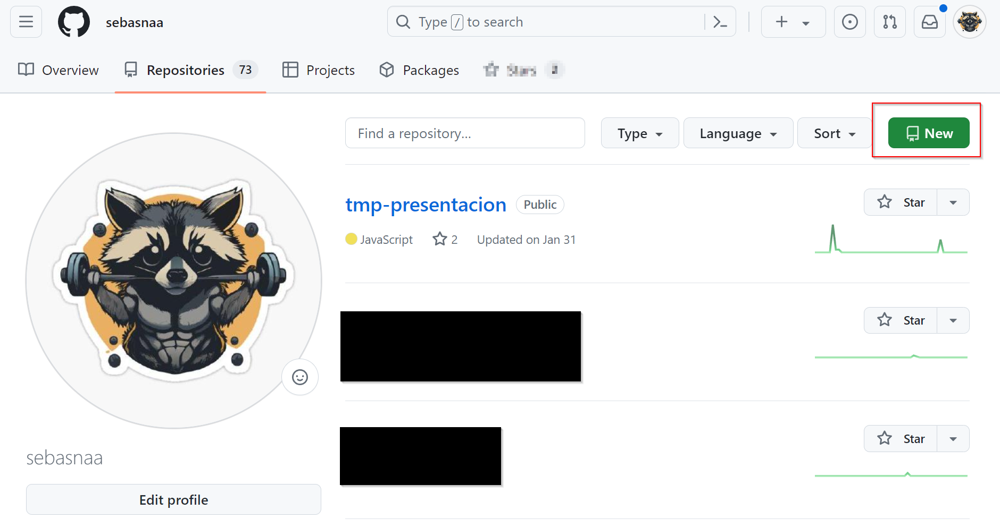
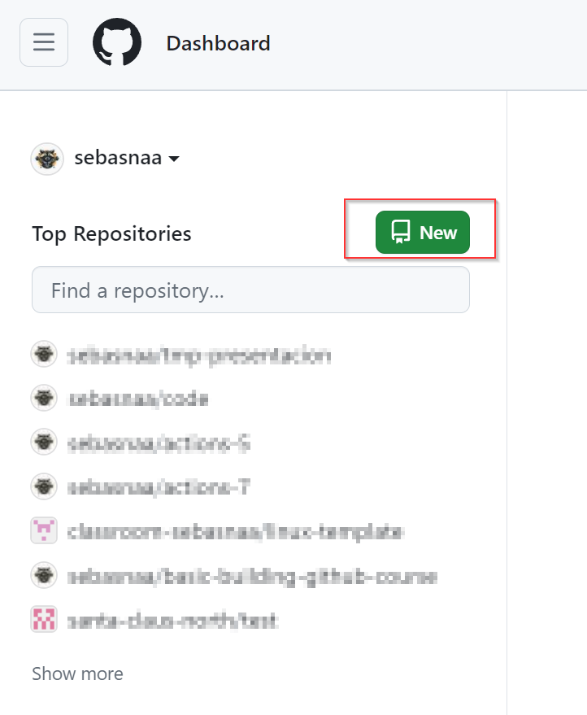
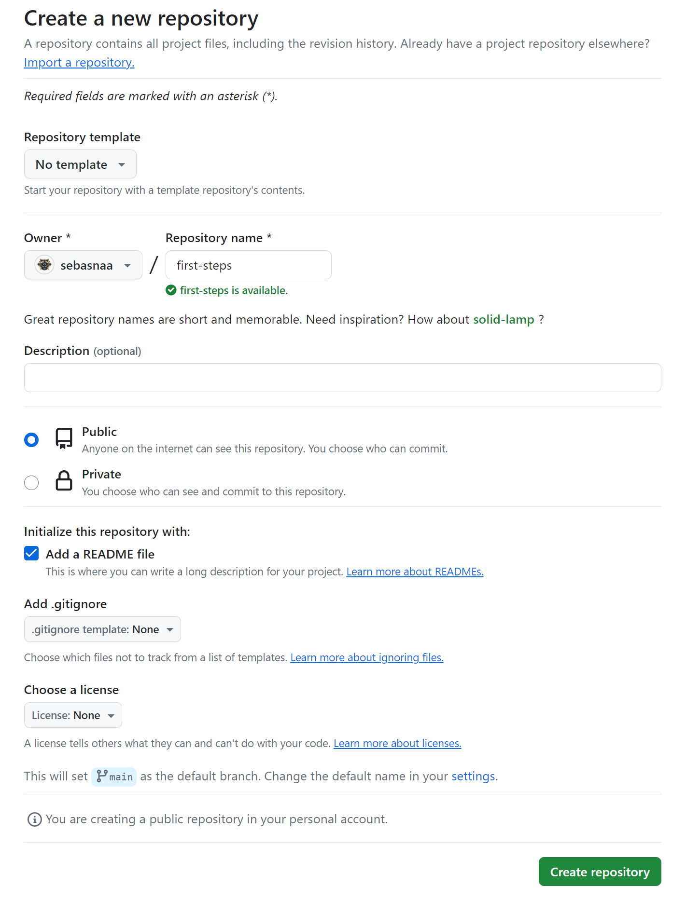
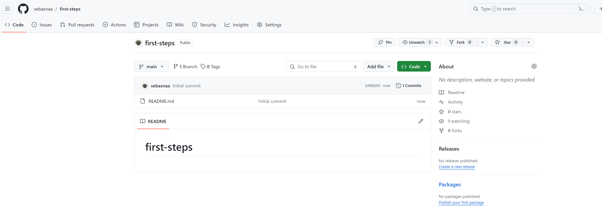
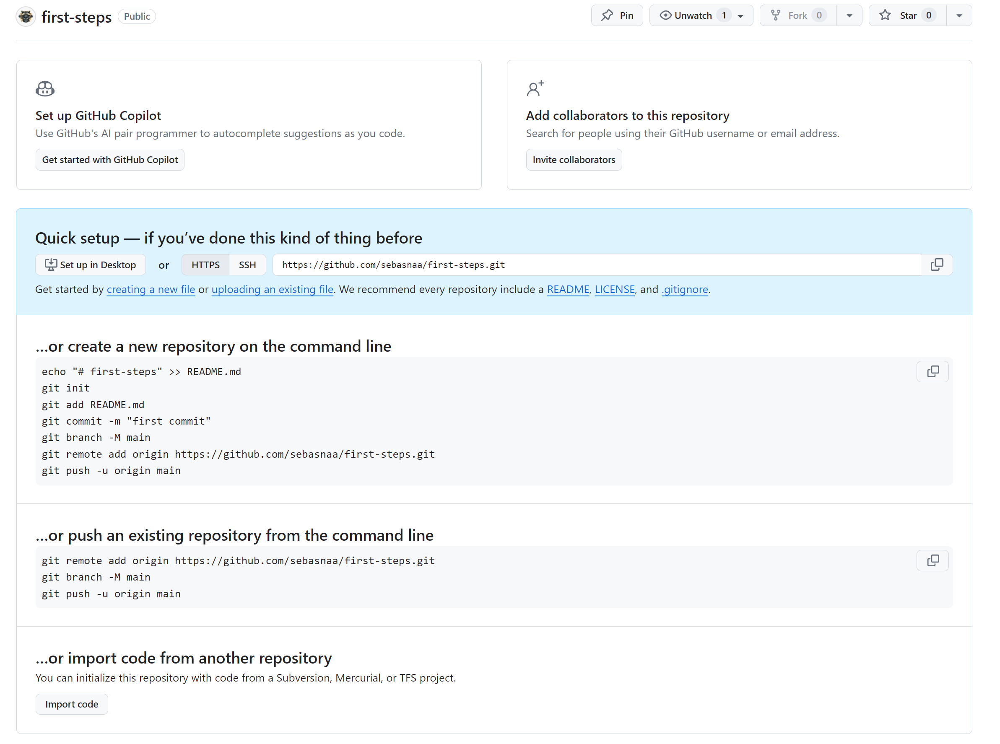
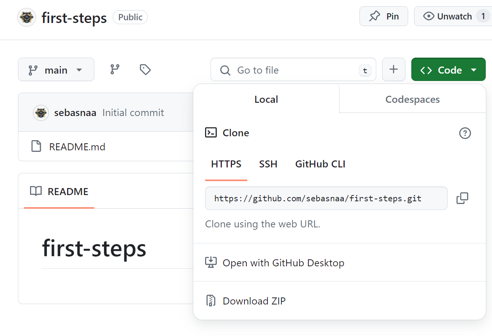
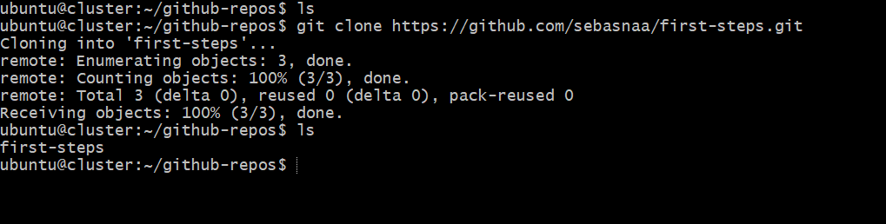

# Guía para crear un repositorio en GitHub

Esta guía proporciona los pasos detallados para crear un repositorio en GitHub

---

## Paso 1: Crear un repositorio en GitHub

### 1.1 Desde tu perfil:

- Ve a [GitHub](https://github.com) y asegúrate de haber iniciado sesión en tu cuenta.
- Haz clic en el botón "New" en la esquina superior derecha de tu página de inicio de GitHub.
- Selecciona "New repository" desde tu perfil.
  
  

### 1.2 Desde tu panel de control:

- Ve a [GitHub](https://github.com) y asegúrate de haber iniciado sesión en tu cuenta.
- Selecciona "New" desde tu panel de control.
  
  

### 1.3 Configuración del repositorio:

- Asigna un nombre al repositorio y, opcionalmente, añade una descripción.
- Selecciona si deseas que el repositorio sea público o privado.
- Decide si quieres agregar un README inicialmente.

  

- Haz clic en el botón "Create repository".

  - Si seleccionaste "Add a README file":

    

  - Si no seleccionaste "Add a README file":

    

## Paso 2: Clonar el repositorio en tu computadora

- Obtén la URL del repositorio desde GitHub.

  

- Abre tu terminal o línea de comandos.
- Utiliza el comando `git clone` seguido de la URL del repositorio que acabas de crear en GitHub.

  
